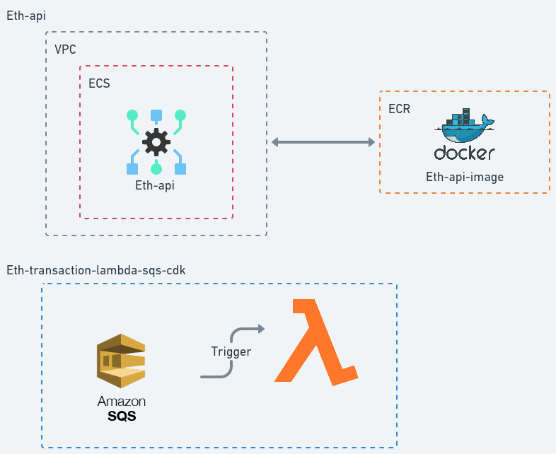

# Ethereum Transaction AWS

This project allows users to perform Ethereum transactions using AWS (Amazon Web Services) resources.

## Architecture

  

## Project specs

Each project has a README.md file with instructions on how to deploy into aws and test it.