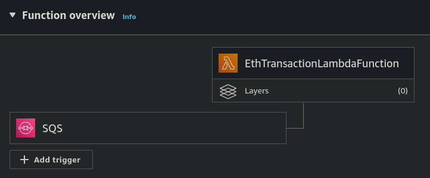

## Lambda Function for Ethereum Transaction Processing

This Lambda function is designed to be triggered for every new message received in an SQS queue. The message content should be an Ethereum transaction in the following format:

<p align="center">
  
</p>

```json
{
  "to": "0xAbC123...",
  "value": "0x1bc16d674ec80000"
}
```

The function performs the following steps:

    Utilizes the previously created service (eth-api) to obtain a Private Key.
    Signs the transaction using the obtained Private Key with its address.
    Sends the signed transaction to an EVM (Ethereum Virtual Machine) Blockchain. In this case it was utilized the goerli testnet.


## Environment Variables

### INFURA_GOERLI_URL
This project utilizes the Goerli testnet for Ethereum network connectivity. To establish a connection with the Goerli testnet, the Infura service is utilized. Follow the steps below to set up the Infura service and configure the project:

    Create an Infura Account: Sign up for an account on the Infura platform at infura.io to obtain the required credentials.

    Obtain Project ID: After creating an account, obtain a Project ID from the Infura dashboard. This ID will be used to authenticate the project with the Infura service.

    Set INFURA_GOERLI_URL Environment Variable: In your project's environment configuration, set the INFURA_GOERLI_URL environment variable to the appropriate value. This variable should be assigned the URL provided by Infura for Goerli testnet connectivity, including the Project ID.

### ETH_API_URL
The URL provided serves as the endpoint for the eth-api service. To obtain this URL, follow the steps below:

    Access the ECS Task: Navigate to the ECS task associated with the project. Open the network tab or network configuration settings.

    Retrieve the Public IP: Locate the public IP address associated with the ECS task. This IP address will be used to access the service.

    Add Port 3333: Append the port number 3333 to the obtained public IP address. This will form the complete URL for accessing the eth-api service.


## Deployment

To deploy the stack, follow the steps below:
```bash
# deploy the stack
cdk deploy

# destroy the stack
cdk destroy
```

## Testing

1. Send the SQS message: 
```bash
  aws sqs send-message --queue-url ENTER_YOUR_SQS_QUEUE_URL --message-body "{"to": "0x455E5AA18469bC6ccEF49594645666C587A3a71B","value": "1000"}"
```
2. Retrieve the logs from the Lambda function or check the CloudWatch logs:
```bash
sam logs -n EthTransactionLambdaFunction
```
Please ensure to replace ENTER_YOUR_SQS_QUEUE_URL with the actual URL of your SQS queue.


